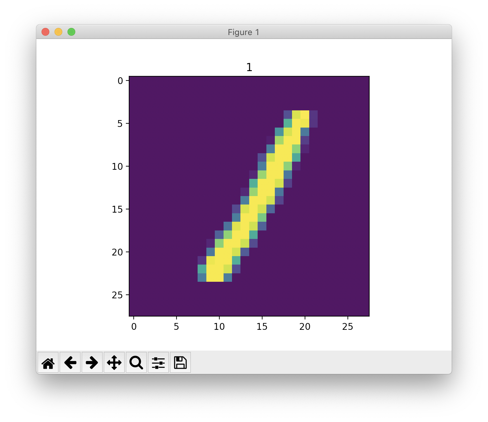

# MNIST

最もシンプルなニューラルネット を作ってみましょう！

ここでは手書き数字データセットのMNISTというものを使います。これには次のような28×28の画像が含まれています。



ここでの課題は、0 ~ 9 までの10個の数字を識別すニューラルネット を作ることです。

まずは使うライブラリを読み込みましょう。

```python
import torch
import torch.nn as nn
import torch.optim as optim
from torch.utils.data import DataLoader
from torchvision.datasets import MNIST
from torchvision.transforms import ToTensor


train_ds = MNIST("./data", train=True, download=True, transform=ToTensor())
test_ds = MNIST("./data", train=False, download=True, transform=ToTensor())
train_loader = DataLoader(train_ds, batch_size=64, shuffle=True)
test_loader = DataLoader(test_ds, batch_size=64, shuffle=False)

```

10行目から14行目でMNISTデータセットをダウンロードしニューラルネット にデータを与えられるようにしています。

では早速、３層のネットワークを定義しましょう。

## Networkの定義

```python
n_class = 10
in_size = 28 * 28

model = nn.Sequential(
    nn.Linear(in_size, 512),
    nn.ReLU(),
    nn.Linear(512, 256),
    nn.ReLU(),
    nn.Linear(256, n_class)
)
```

ここでいくつか新しい用語が出てきたので解説します。

* `nn.Linear()`

一般的に全結合層と呼ばれる層の事です。数式で表すと、

$$
y = xW + b
$$

`と書く事が出来ます。xは入力、Wは重み、bはバイアスです。`

* `nn.ReLU()`

`ReLU関数は以下のように示される活性化関数です。`


`ニューラルネットは基本的に層と活性化関数交互に重ねて設計されます。`

## 学習

ネットワークの定義が完了したので早速訓練をしましょう！

```python
def fit(net, opt, criterion, loader, epochs):
    device = torch.device("cuda" torch.cuda.is_available() else "cpu")    
    net = net.to(device)        
    for epoch in range(epochs):        
        for data, label in loader:            
            data = data.view(-1, in_size)                        
            data = data.to(data)            
            label = label.to(data)
                        
            opt.zero_grad()            
            output = net(data)            
            loss = criterion(output, label)            
            
            loss.backward()            
            opt.step()   
                 
    print("{}/{} - loss: {:.4f}".format(epoch+1, epochs, loss.cpu().item()))    
    return net


optimizer = optim.Adam(model.parameters())
model = fit(model, optimizer, nn.CrossEntropyLoss(), train_loader, epochs=10)
```

`fit()関数について解説していきます。まず一行目の`

```python
torch.device("cuda" torch.cuda.is_available() else "cpu")
```

は、GPUが利用可能な場合 `"cuda"` が選択されCPUのみの場合 `"cpu"` が選択されます。この結果は、

```python
net = net.to(device)
```

`や`

```python
data = data.to(data)
label = label.to(data)
```

で利用されます。  
では、 `for の中身を見ていきましょう。`

```python
data = data.view(-1, in_size)
```

は今回用いるネットワークが全結合層で構成されている為、入力は `[samples, features]` の２次元配である必要がある為、元々の形状 `[samples, channels, features]` から変更しています。

### `評価`

では学習したネットワークの性能を評価してみましょう。

```python
def evaluate(net, loader):
    device = torch.device("cuda" torch.cuda.is_available() else "cpu")
    net = net.eval()        
    correct = 0    
    total = 0        
    
    with torch.no_grad():        
        for data, labels in loader:            
            data = data.to(device)            
            labels = labels.to(device)    
                                
            outputs = net(data)            
            _, pred = torch.max(outputs, 1)            
            total += labels.shape(0)            
            correct += (predicted == labels).sum().item()                
            
        print("Accuracy: {:.4%}".format(correct / total))
```


\`\`

