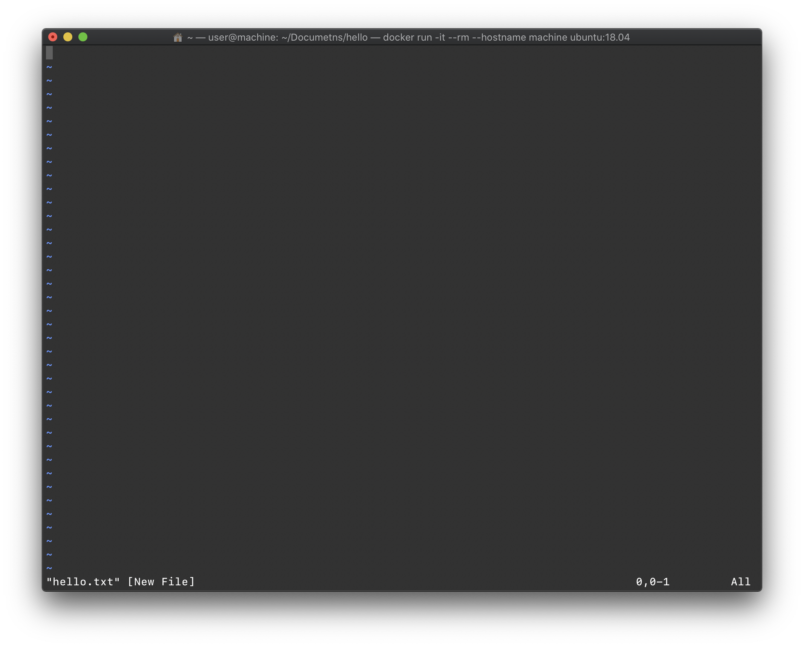

# Hello, Unix/Linux

多くの学生が一年生のプログラミング入門の授業でUnix/Linux likeな環境に触れたことがあります。そう、Cygwinです。しかし、残念ながら日常的にそういった環境をいじっている学生は少ないようです。そういう人たちであっても研究で公開されている論文実装やライブラリをいじる必要に駆られることでしょう。そして、そういった物の多くは本物のUnix/Linux環境での動作を前提としている事が非常に多いです。ここでは、Unix/Linux初心者相手に困らない程度の基本的なコマンドを説明していきます。

### Run Terminal

まずターミナル\(端末\)を開いてみましょう。懐かしいウィンドウが開くはずです。

```text
user@machine:~$ 
```

まず、この文の意味を説明します。最初の `user` の部分は現在ログインしているユーザ名、`machine` は現在ログインしているコンピュータの名前、`~` の位置にはカレントディレクトリが入ります。ちなみに、`~` はホームディレクトリを意味します。

では、今いるディレクトリに何が含まれているを見てみましょう。

```text
user@machine:~$ ls
```

と入力してください。すると、

```bash
user@machine:~$ ls
Documents/    Downloads/    Desktop/    ....
```

といった結果が出てくるはずです。\(環境によっては日本語で表示されることがあります\)  
では、`Documents` ディレクトリに移ってみましょう。

```bash
user@machine:~$ ls
Documents/    Downloads/    Desktop/    ....
user@machine:~$ cd Documents/
user@machine:~/Documents$ 
```

ディレクトリを移動できました。折角なので新しいディレクトリを作成してその中に入ってみましょう。

```bash
user@machine:~/Documents$ mkdir hello
user@machine:~/Documents$ cd hello/
```

では、新しいファイルを作成してみましょう。

### Install Application

UbuntuにはデフォルトでVimがインストールされていないのでコマンドでインストールを行います。

```bash
sudo apt-get update && apt-get install -y vim
```

このコマンドの意味は

* `sudo` ... 管理者権限を一時的に付与
* `apt-get update` ... インストール可能なパッケージを最新版に更新
* `apt-get install -y アプリケーション名` ... 指定したアプリケーションをダウンロードしインストール。`-y` オプションは聞かれる質問に全てyes で答えるの意味

### Vim

ではVimを使ってファイルを作成してみましょう。

```bash
user@machine:~/Documents/hello$ vim hello.txt
```



起動したのちこう言った画面が表示されます。この状態では文章の入力ができません。これは現在**ノーマルモード** になっているためです。そこで**インサートモード**に切り替えます。`a` もしくは `i` を入力してください。適当な文章を入力した後、`esc` をノーマルモードに切り替えた後、 `:wq` を入力しファイルを保存・終了します。

### ファイルの移動・コピー・削除

では、作成したファイルを移動してみましょう。現在のディレクトリ は `pwd` コマンドから分かるように `/home/user/Documetns/hello` です。親ディレクトリに作成したhello.txtを移動させてみましょう。

```bash
user@machine:~/Documents/hello$ mv hello.txt ../
```


`mv` の文法は

```bash
mv 対象ファイル 移動先
```

これの応用としてファイル名の変更もこのコマンドで可能です。


移動していることを確認してみましょう。

```bash
user@machine:~/Documents/hello$ ls    # <- 存在しないuser@machine:~/Documents/hello$ cd ../user@machine:~/Documents$ ls    # <- 存在する
```

ではこのファイルを複製してみましょう。

```bash
user@machine:~/Documents$ cp hello.txt hello_copy.txt
```


`cp` の文法は`mv`と同じく

```bash
cp 対象ファイル 保存先
```

です。


では最後に作成したコピーを削除しましょう。

```bash
user@machine:~/Documents$ rm hello_copy.txt
```


rm でファイルを削除する際は、

```bash
rm 対象ファイル
```

で可能ですが、ディレクトリ を削除する際は、

```bash
rm -r 対象ディレクトリ 
```

とする必要があります。



