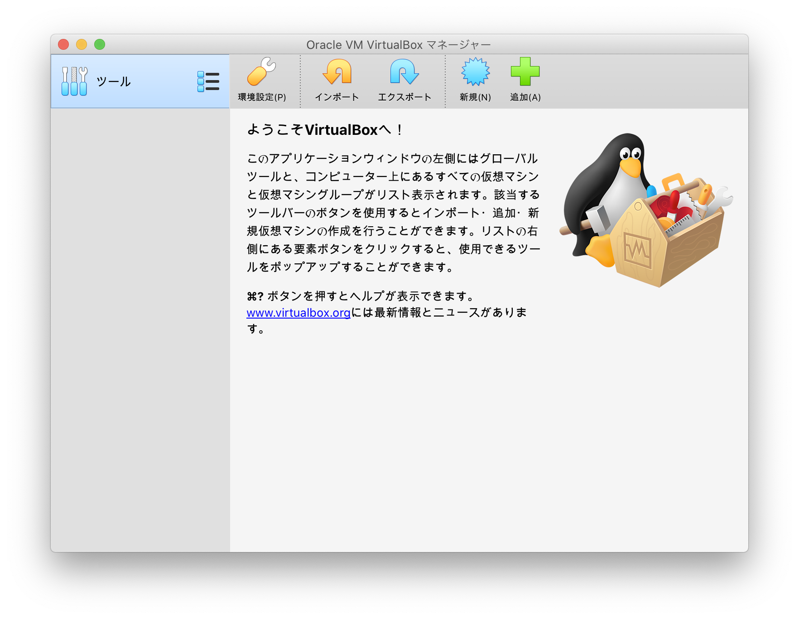
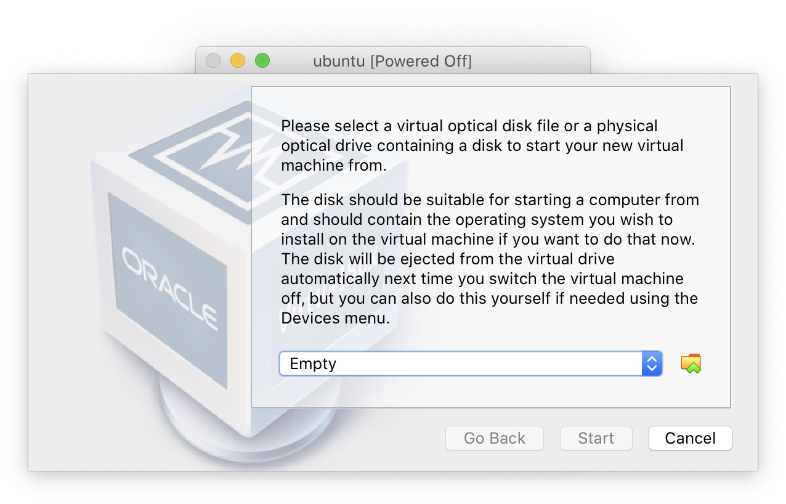
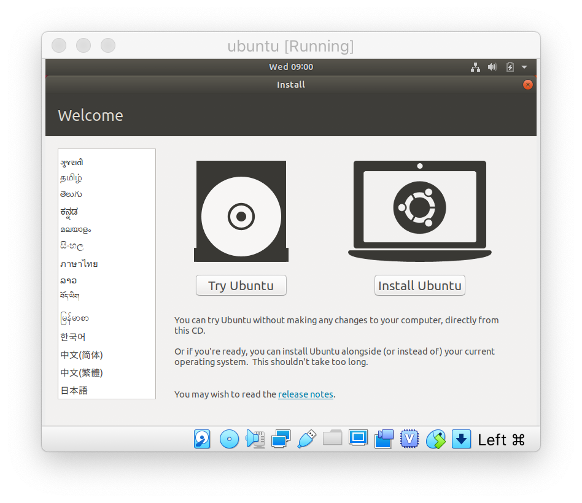
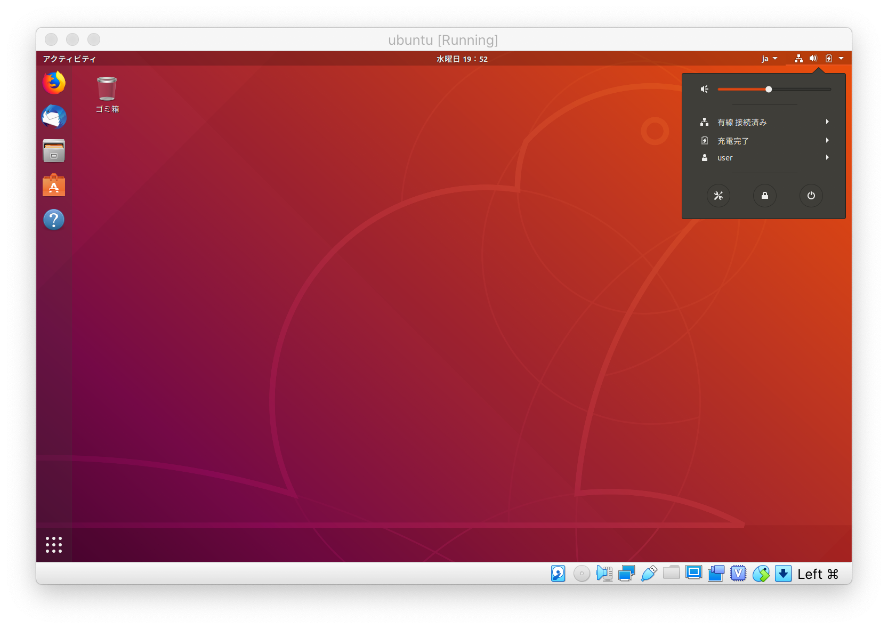

# Install Linux

VirtualBoxなどの仮想化ソフトがインストール済みであると仮定して解説します。

### Download & Install Ubuntu

まずUbuntuを入手しましょう。Linuxは本来カーネル単体のことを指します。OSとして使えるようにするには各種ライブラリやコマンドなどを用意しなくてはなりません。そう言ったものを整備して配布している団体・プロジェクトのことをディストリビューションと呼びます。Ubuntuはそのうちの一つです。


さっそく、OSのイメージを入手しましょう。プロジェクトページからダウンロードしてもいいのですが、大抵混んでいてダウンロードに時間がかかります。そこで、理化学研究所が提供しているミラーページから[ダウンロード](http://ftp.riken.go.jp/Linux/ubuntu-releases/)します。いくつか項目がありますが、このうち **18.04/** を選択してください。


Ubuntuは年に2回、4月と10月にリリースされます。また、2年に一回のペースで長期サポート版\(LTS\)というものがあります。現在の長期サポート版は16.04、18.04です。


OSイメージがダウンロードできたら早速、仮想マシンにインストールしましょう。はじめてVirtualBoxを起動すると次のような画面が表示されるはずです。



右上の**新規**をクリックしてください。

Ubuntuの推奨システムは

* メインメモリ:  2GB
* ハードディスクの空き容量: 25GB
* 2GHz以上のデュアルコアCPU

なので、仮想マシンの設定は、

* メインメモリ: 2048MB
* ハードディスク容量: 30GB

にしてください。

設定が完了したら起動ボタンを押して起動してください。初回起動時は以下のようなウィンドウが表示されるはずです。ここで先ほどダウンロードしたUbuntuのisoイメージを指定してください。



起動が完了すると次のようなインストールウィザードが表示されるはずです。左側から日本語を選択して `Install Ubuntu` をクリックしてください。

なお、残念ながらこの段階では解像度の調整ができません



インストールは非常に簡単で、基本的には **続ける** を押し続ければ問題ありませんが、3番目の項目「**アップデート他のソフトウェア**」では 「**最小インストール**」  を選択してください。

ユーザ名を設定する箇所はお好きなものを設定してください。後は放っておけば完了します。

インストール後、初めて起動した際に、ソフトウェアの更新をするか聞かれます。インストールすることをお勧めします。


もしインストール後、黒い画面から遷移しなくなった場合は、Enterキーを一回押してみてください。


### VirtualBox Guest Additions \(option\)

解像度の調整をしたいので、**VirtualBox Guest Additions** をインストールします。

VirtualBoxのメニューにある `Devices` から `Insert Guest Additions CD image...` をクリックしてください。自動起動するかどうか聞かれるので起動を選択してください。インストールが完了すれば解像度が最適化されるはずです。  
インストールが完了したら、デスクトップのCDアイコンを右クリックして「取り出す」を選択してください。

### Install Docker

最後にDockerをインストールします。Dockerにはroot権限を要求するものとrootless のものの２種類があります。ここでは、ひとまずrootless Dockerを入手しインストールします。そのために、いくつかのコマンドをインストールします。

まずは、Windowsのスタートボタンがある位置にあるボタンをクリックしてください。検索窓に「端末」と入力しターミナルを起動してください。そして、以下のコマンドを入力してください。

```bash
sudo apt-get update && apt-get install -y curl
cat << EOF | sudo sh -x 
apt-get install -y uidmap
EOF
```

１行目のコマンドを実行した際にパスワードを要求されます。自身が設定したパスワードを入力してください。インストール完了後次のコマンドを入力してください。

```bash
curl -sSL https://get.docker.com/rootless | sh
```

処理完了後、次のような表示がされると思います。\(**環境によって記載されている内容が異なる可能性があります。**\)

```bash
# Docker binaries are installed in /home/user/bin
# WARN: dockerd is not in your current PATH or pointing to /home/user/bin/dockerd
# Make sure the following environment variables are set (or add then to ~/.bashrc):

export PATH=/home/user/bin:$PATH
export DOCKER_HOST=unix:///run/user/1000/docker.sock

#
# To control docker service run:
# systemclt --user (start|stop|restart) docker
#
```

この例の5・6行目にあたる箇所を見つけて、以下のコマンドの2・3行目にあたる項目を置き換えた上で入力してください。

```bash
cat << EOF >> ~/.bashrc
export PATH=/home/$USER/bin:$PATH
export DOCKER_HOST=unix:///run/$USER/1000/docker.sock
EOF
```

その後、次のコマンドを入力してください。

```bash
source ~/.bashrc
systemctl --user start docker
```

これでDockerがインストールできたはずです。早速使ってみましょう。

```bash
docker run docker/whalesay cowsay Hello!!
```

クジラがHello! と言っていれば完了です。


再起動時に

```
Cannot connect to the Docker daemon at unix:///run/user/1000/docker.sock.
Is the docker deamon running?
```

と出た場合は、

```bash
systemctl --user start docker
```

を実行してください。


### Ubuntuのシャットダウン

Ubuntuではコマンドラインかシステムを終了する事が出来ますが、手っ取り早くGUIでの方法を説明します。



右上のバッテリーマークをクリックし右側の電源アイコンをクリックし電源をオフを選択してください。

